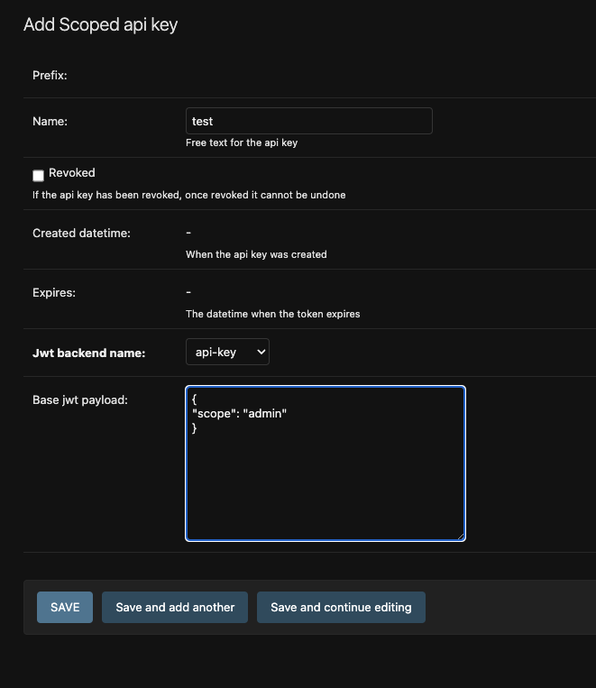
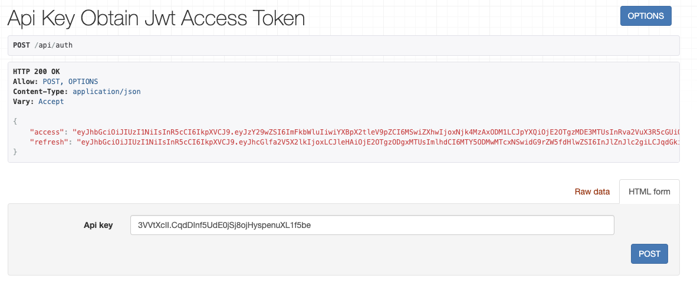

# Using api keys
API key format: `{prefix}.{secret}`

## API key Models

### `AbstractAPIKey` consists of:
* prefix: api key prefix (prefix).(secret), used to identify the api key.
* hashed_key: The hashed secret keys.
* name: name the api key, used to identify the recipient.
* revoked: This field can be set to true to revoke the api key, after this is set to True it cannot be set to False again.
* created: created datetime
* expiration_datetime: expiration datetime, after this timestamp the api key cannot be used.

### `ScopedAPIKey` extends `AbstractAPIKey`
The intended use of the `ScopedAPIKey` model is together with jwt.
In addition to the `AbstractAPIKey`, `ScopedAPIKey` consists of two more fields:
* jwt_backend_name: The name of the jwt backend which will be used to issue and verify the token.
* base_jwt_payload: Additional payload for the jwt token, this can for instance be used to define access scope.

ScopedAPIkey can be created through django admin. The api key itself with prefix and secret will only be displayed once in a message after creation.


## Setting up project for api keys

### Prerequisites
```bash
$ pip install ievv-auth djangorestframework
```

### Installed apps

```py
INSTALLED_APPS = [
    ...,
    'ievv_auth.ievv_api_key',
    'ievv_auth.ievv_jwt'
]
```

### Settings
```py
#: Api key settings
IEVV_API_KEY_EXPIRATION_DAYS = 180 # 180 days is default
#: JWT backend settings
from django.utils import timezone
IEVV_JWT = {
    'api-key': { # name of the backend
        'ACCESS_TOKEN_LIFETIME': timezone.timedelta(minutes=2),             # Access token lifetime.
        'REFRESH_TOKEN_LIFETIME': timezone.timedelta(days=1),               # Refresh token lifetime if None refresh token is not issued.
        'USE_BLACKLIST': False,                                             # Use the blacklist app, Default backend does not support blacklist.
        'BLACKLIST_AFTER_ROTATION': False,                                  # Blacklist token after rotation, Default backend does not support blacklist.
    
        'ALGORITHM': 'HS256',                                               # Algorithm.
        'SIGNING_KEY': SECRET_KEY,                                          # Signing key.
        'VERIFYING_KEY': None,                                              # Verifying key used when using private/public key algorithms such as RSA.
        'AUDIENCE': None,                                                   # Not mandatory Audience could be s resource server url or a list of urls where the token is intended for.
        'ISSUER': None,                                                     # Not mandatory issuer could be a url, domain, organization or person.
    
        'TOKEN_TYPE_CLAIM': 'token_type',                                   # Token type payload name.
        'UPDATE_LAST_LOGIN': True,                                          # Only used by user auth.

        'JTI_CLAIM': 'jti',                                                 # JTI claim payload field.
    }
}
```

## Creating a scoped api keys through djangoadmin
**The payload can be what ever you like and will be accessible through `request.auth` in api keys to do permission checks.**

**The created api key will only be shown once so make sure to copy and store it on a safe palce.**


## API

### setup authentication view url paths
```py
from django.urls import path
from ievv_auth.ievv_jwt.api.views import APIKeyObtainJWTAccessTokenView, RefreshJWTAccessTokenView

urlpatterns = [
    ...,
    path('api/auth', APIKeyObtainJWTAccessTokenView.as_view(), name='api-key-auth'),
    path('api/refresh', RefreshJWTAccessTokenView.as_view(), name='jwt-refresh')
]
```
You can now obtain your tokens through the api auth view.



### Authentication classes

Setup as default authentication class.
```py
REST_FRAMEWORK = {
    'DEFAULT_AUTHENTICATION_CLASSES': [
        ...,
        'ievv_auth.ievv_jwt.api.authentication.JWTAuthentication'
    ]
}
```
Or you can set it directly in your views.
```py
from rest_framework.views import APIView
from rest_framework.response import Response

from ievv_auth.ievv_jwt.api.authentication import JWTAuthentication 


class MyView(APIView):
    authentication_classes = (JWTAuthentication, ) 
    def get(self, request, format=None):
        return Response({'hello': 'world'})

```

JWT payload will now be accessible through `request.auth`

### Permission classes
Previously we created a token with the payload `{"scope": "admin"}`, we could for instance run permission checks on the payload.
```py
from rest_framework import permissions
from ievv_auth.ievv_jwt.api.authentication import JWTAuthentication
from rest_framework.views import APIView


class CustomPermission(permissions.BasePermission):
    def has_permission(self, request, view):
        return request.auth is not None and request.auth.get('scope', None) == 'admin'


class MyView(APIView):
    permission_classes = (CustomPermission, )
    authentication_classes = (JWTAuthentication, )
    ...
```

## Using the blacklist app
Issued refresh tokens will be added to the database, and can be manually or automatically blacklisted when needed.
The setting `BLACKLIST_AFTER_ROTATION` when `True` will automatically blacklist the previous refresh token after rotation.
### Installed apps

```py
INSTALLED_APPS = [
    ...,
    'ievv_auth.ievv_jwt_blacklist_core',
    'ievv_auth.ievv_jwt_blacklist_api_key'
]
```

### Settings

```py
IEVV_JWT = {
    'api-key': { # name of the backend
        ...,
        'USE_BLACKLIST': True,                                             # Use the blacklist app, Default backend does not support blacklist.
        'BLACKLIST_AFTER_ROTATION': True,                                  # Blacklist token after rotation, Default backend does not support blacklist.
    }
}
```
