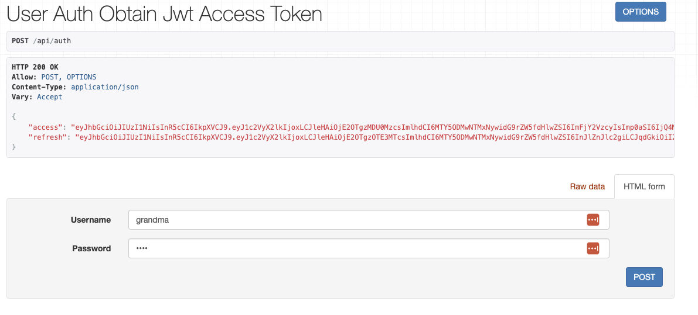

# JWT user auth

## Setting up project for JWT user auth

### Prerequisites
```bash
$ pip install ievv-auth djangorestframework
```

### Installed apps

```py
INSTALLED_APPS = [
    ...,
    'ievv_auth.ievv_jwt'
]
```

### Settings
```py
#: JWT backend settings
from django.utils import timezone
IEVV_JWT = {
    'user-auth': { # name of the backend
        'ACCESS_TOKEN_LIFETIME': timezone.timedelta(minutes=2),             # Access token lifetime.
        'REFRESH_TOKEN_LIFETIME': timezone.timedelta(days=1),               # Refresh token lifetime if None refresh token is not issued.
        'USE_BLACKLIST': False,                                             # Use the blacklist app, Default backend does not support blacklist.
        'BLACKLIST_AFTER_ROTATION': False,                                  # Blacklist token after rotation, Default backend does not support blacklist.
    
        'ALGORITHM': 'HS256',                                               # Algorithm.
        'SIGNING_KEY': SECRET_KEY,                                          # Signing key.
        'VERIFYING_KEY': None,                                              # Verifying key used when using private/public key algorithms such as RSA.
        'AUDIENCE': None,                                                   # Not mandatory Audience could be s resource server url or a list of urls where the token is intended for.
        'ISSUER': None,                                                     # Not mandatory issuer could be a url, domain, organization or person.
    
        'TOKEN_TYPE_CLAIM': 'token_type',                                   # Token type payload name.
        'UPDATE_LAST_LOGIN': True,                                          # Only used by user auth.

        'JTI_CLAIM': 'jti',                                                 # JTI claim payload field.
    }
}
```


## API

### setup authentication view url paths
```py
from django.urls import path
from ievv_auth.ievv_jwt.api.views import get_user_auth_obtain_jwt_access_token_view, RefreshJWTAccessTokenView

urlpatterns = [
    ...,
    path('api/auth', get_user_auth_obtain_jwt_access_token_view().as_view(), name='api-key-auth'),
    path('api/refresh', RefreshJWTAccessTokenView.as_view(), name='jwt-refresh')
]
```
You can now obtain your tokens through the auth view with username and password.


The default payload for the user auth backend is:
```json
{
  "user_id": 1, 
  "exp": 1698305437,
  "iat": 1698305317,
  "token_type": "access",
  "jti": "4847e6cb50e0451791284a66ea8c311b",
  "jwt_backend_name": "user-auth"
}
```
Where the user_id comes from the authenticated users.

### Authentication classes

Setup as default authentication class.
```py
REST_FRAMEWORK = {
    'DEFAULT_AUTHENTICATION_CLASSES': [
        ...,
        'ievv_auth.ievv_jwt.api.authentication.JWTAuthentication'
    ]
}
```
Or you can set it directly in your views.
```py
from rest_framework.views import APIView
from rest_framework.response import Response

from ievv_auth.ievv_jwt.api.authentication import JWTAuthentication 


class MyView(APIView):
    authentication_classes = (JWTAuthentication, ) 
    def get(self, request, format=None):
        return Response({'hello': 'world'})

```

JWT payload will now be accessible through `request.auth`

### Permission classes
In this example we will just check that the `user_id` is `1`.
```py
from rest_framework import permissions
from ievv_auth.ievv_jwt.api.authentication import JWTAuthentication
from rest_framework.views import APIView


class CustomPermission(permissions.BasePermission):
    def has_permission(self, request, view):
        return request.auth is not None and request.auth.get('user_id', None) == 1


class MyView(APIView):
    permission_classes = (CustomPermission, )
    authentication_classes = (JWTAuthentication, )
    ...
```

## Using the blacklist app
Issued refresh tokens will be added to the database, and can be manually or automatically blacklisted when needed.
The setting `BLACKLIST_AFTER_ROTATION` when `True` will automatically blacklist the previous refresh token after rotation.
### Installed apps

```py
INSTALLED_APPS = [
    ...,
    'ievv_auth.ievv_jwt_blacklist_core',
    'ievv_auth.ievv_jwt_blacklist_user'
]
```

### Settings

```py
IEVV_JWT = {
    'user-auth': { # name of the backend
        ...,
        'USE_BLACKLIST': True,                                             # Use the blacklist app, Default backend does not support blacklist.
        'BLACKLIST_AFTER_ROTATION': True,                                  # Blacklist token after rotation, Default backend does not support blacklist.
    }
}
```

## Extend the backend
Since JWT's are stateless we can encode permissions or other useful information in the JWT payload.

Custom backend example:
```py
# custom_user_backend.py
from ievv_auth.ievv_jwt.backends.user_auth_backend import UserAuthBackend

class CustomUserAuthBackend(UserAuthBackend):

    def make_access_token_payload(self) -> dict:
        payload = super().make_access_token_payload()
        # Here we can extend the jwt payload, `self.user_instance` is accessible.
        payload.update({
            'is_staff': self.user_instance.is_staff
        })
        return payload

```

Regiser the backend:
```py
# apps.py
from django.apps import AppConfig


class MyApp(AppConfig):
    ...

    def ready(self):
        from ievv_auth.ievv_jwt.backends.backend_registry import JWTBackendRegistry
        from .custom_user_backend import CustomUserAuthBackend
        registry = JWTBackendRegistry.get_instance()
        registry.set_backend(CustomUserAuthBackend)

```

We now have `is_staff` in the JWT payload and can be used in permission classes:
```py
from rest_framework import permissions


class CustomPermission(permissions.BasePermission):
    def has_permission(self, request, view):
        return request.auth is not None and request.auth.get('is_staff', False)
```

## Multiple backends for different purposes.
We can also run multiple backends for different purposes.

Just make sure to set a new backend name:
```py
# custom_user_backend.py
from ievv_auth.ievv_jwt.backends.user_auth_backend import UserAuthBackend


class CustomUserAuthBackend(UserAuthBackend):

    @classmethod
    def get_backend_name(cls):
        return 'user-auth-custom'
    
    def make_access_token_payload(self) -> dict:
        payload = super().make_access_token_payload()
        # Here we can extend the jwt payload, `self.user_instance` is accessible.
        payload.update({
            'is_staff': self.user_instance.is_staff
        })
        return payload
```

Register the backend and setup a different login endpoint for the backend.
```py
from django.urls import path

from ievv_auth.ievv_jwt.api.views import get_user_auth_obtain_jwt_access_token_view


urlpatterns = [
    ...,
    path('api/auth', get_user_auth_obtain_jwt_access_token_view(backend_name='user-auth-custom').as_view(), name='api-key-auth'),
]
```

The settings for the backend can also be modified like this:
```py
IEVV_JWT = {
    'user-auth-custom': {
        # settings
    }
}

```
